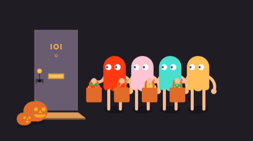

  

  <h1>أباالفضل | Abaalfadel</h1>

  

    Mobile • Web • Game Developer
  

  <!-- OFFICIAL GITHUB BADGES -->
  

    
    
    
  

  

  
  

    
    
  

---

  
  
  
  
  
  

---

  <!-- App Development -->
  
  

  <!-- Web Development -->
  
  
  

  <!-- Game Development -->
  
  

  <!-- Tools -->
  
  

---

  
  

  

---

  
  &nbsp;&nbsp;
  
  &nbsp;&nbsp;
  
  &nbsp;&nbsp;
  

 

  

  👆🏻Click on the image to go to my website👆🏻

---

  

---

  Last update: December 2025

